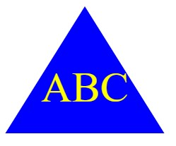
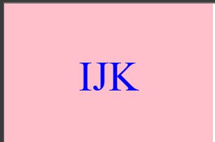

# SVG Logo Maker: Object-Oriented Programming

## My Task

My task was to build an application with Node.js in the command-line. This application generates SVGs based upon user selection. They are able to select one of three shapes, (Square, Circle, and Triangle), then pick the color of that shape, add text as a logo, and even select a color for the text as well. This generated SVG will live inside of a logo.svg once the prompt and the rendering is complete.

I have provided a link to a video walkthrough given the fact that this application will not be deployed this serves as a demonstration to its functionality. 

 **Note**: There was no starter code for this assignment so everything in this repos is coded from scratch.

### User Story

```md
AS a Full-Stack Web Developer
I WANT to be able to have custom logos for my projects to avoid the price of purchasing one
SO I have created a way to generate them and cut the cost
```

## Acceptance Criteria

```md
GIVEN a command-line application that uses prompts to collect user selection
WHEN I am prompted for shape color
THEN I can select from a list
WHEN I am prompted for text color
THEN I can select color from a list
WHEN I am prompted for shape for the svg
THEN I can select from a list of three (square, circle, triangle)
WHEN I am prompted for text input
THEN I can enter text up to three characters
WHEN I have completed ALL prompts
THEN the `logo.svg` file will be updated with the selections made by the user
AND the command-line will indicate completion by printing out "Generated logo.svg"
WHEN I open the `logo.svg` file in a browser
THEN the intended logo will be displayed with the correct pixels (300x200 px) and it will matched the criteria entered
```

## Mock-Up

The following image shows the mock-up of the generated SVG that I was aiming to recreate based upon user input. As you can see in this example the user has chosen `green` for the shape color, `white` for the text color, `circle` from the list of shapes, and `SVG` for the text. Note that this is just an image of the output SVG and not the SVG file itself:


## Additional Requirements

This challenge incorporates a multitude of topics and skills that were covered thus far in the course. I was given a User Story and Acceptance Criteria, along with a several reference links to get me started and see the assignment through to the finish. 

It was recommended that I followed a particular file structure for my directory and you will see that the structure I have created will reflect the intended way of going about that.

  **Important**: I have made that `dist` was not with the `.gitignore` file and my application's repository is trackable on Git since that is not creating any push errors.
  This application includes `Square`, `Circle`, and `Triangle` classes, and have been individually tested as well using Jest. You will also see that these three shapes share commonalities and with that being the case I have created a super/parent class and named it `Shape`. The `Square`, `Circle`, and `Triangle` classes inherit code from the super/parent class.

  Each shape have been tested for a `render()` method using the recommended test code example as a guide and have passed these test when running npm run test. 


## Review 

The following has been placed here to meet requirements for review:

Refer to the following 
[Video Submission](https://drive.google.com/file/d/1rJkLV2G5WexE9zcrZ43QV1_ttPI3WmsY/view) for a brief demonstration of my application to see its functionality

Refer to this link [GitHub Repository](https://github.com/TheKhalidGibson/SVGLogoMaker) to view and explore the GitHub repo for this assignment


## Screenshots

These are the example SVG files:






